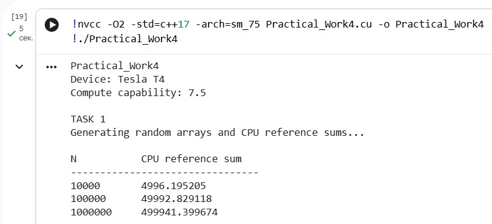
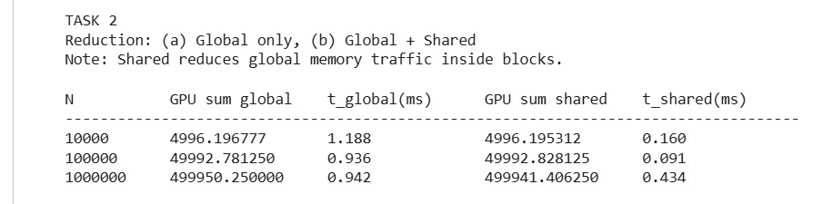
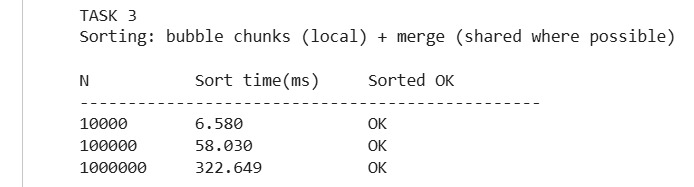

# Practical_Work4

## Таск 1. 

В первом задании реализована подготовка данных для дальнейших вычислений на GPU. На стороне CPU генерируется массив случайных чисел с использованием генератора `std::mt19937` и равномерного распределения в диапазоне `[0; 1]`. Далее данные используются в последующих задачах для редукции и сортировки на GPU.  

Эксперименты выполняются для трёх размеров входного массива: **10 000**, **100 000** и **1 000 000** элементов. Дополнительно вычисляется эталонная сумма на CPU, чтобы затем сравнить корректность результата редукции на GPU. В консоли программа выводит параметры устройства (Tesla T4, compute capability) и таблицу с рассчитанной CPU reference sum для каждого размера массива.

Результаты выполнения программы представлены на скриншоте:

  

  

---

## Таск 2. 

Во втором задании реализованы две версии CUDA-редукции суммы элементов массива, чтобы сравнить влияние типа памяти на производительность. Первая версия использует только глобальную память и атомарное сложение. Каждый поток читает элементы массива из global memory, суммирует их в локальной переменной и затем выполняет `atomicAdd` в один общий аккумулятор в глобальной памяти. Такой подход прост, но из-за большого количества атомарных операций по одному адресу возникает высокая конкуренция потоков, что ограничивает скорость.

Вторая версия использует комбинацию global и shared memory. На первом этапе каждый блок загружает свои данные из глобальной памяти в shared memory и выполняет редукцию внутри блока, используя быстрый доступ shared memory. После этого каждый блок записывает одну частичную сумму в global memory. Далее выполняются дополнительные проходы редукции, пока не останется единственное значение. За счёт того, что основная часть сложений выполняется в shared memory, уменьшается число обращений к global memory и снижается стоимость синхронизации через атомарные операции.  

По результатам замеров видно, что вариант **Global + Shared** работает быстрее, особенно на больших размерах массива, так как shared memory позволяет выполнить значительную часть вычислений локально внутри блока и сократить глобальный трафик.

Результаты выполнения программы представлены на скриншоте:

  

  

---

## Таск 3. 

В третьем задании реализована сортировка массива на GPU таким образом, чтобы продемонстрировать использование локальной, глобальной и разделяемой памяти. Сначала массив разбивается на небольшие подмассивы (чанки) фиксированного размера `CHUNK_SIZE`. Для каждого чанка выполняется пузырьковая сортировка. Внутри ядра данные чанка читаются из global memory, копируются в локальный массив потока (local memory/регистры), сортируются пузырьком и затем записываются обратно в global memory. Такой подход соответствует требованию “использовать локальную память для небольших подмассивов” и позволяет держать временные значения максимально близко к вычислениям.

После сортировки чанков выполняется слияние (merge) отсортированных сегментов. На ранних этапах, пока размер сегмента небольшой, используется вариант merge через shared memory: две части (левая и правая) копируются из global memory в shared memory блока, после чего выполняется слияние в выходной массив. Shared memory здесь служит быстрым буфером, уменьшая количество медленных обращений к global memory во время сравнения элементов. Когда размер сегмента становится слишком большим для shared memory, используется корректный fallback-merge без shared memory, чтобы программа работала стабильно для больших массивов.  

Важно отметить, что данная сортировка реализована в учебных целях для демонстрации типов памяти. Пузырьковая сортировка и упрощённая организация merge не являются самым быстрым способом сортировки на GPU, однако хорошо показывают принципы использования local и shared memory.

Результаты выполнения программы представлены на скриншоте:

  

  

---

## Таск 4. 

В четвёртом задании проводится измерение времени выполнения реализованных GPU-алгоритмов для трёх размеров массива: **10 000**, **100 000** и **1 000 000** элементов. Для каждого `N` измеряется время редукции суммы в варианте “только global memory” и в варианте “global + shared”, а также время сортировки (bubble chunks + merge). Измерение времени выполняется с помощью CUDA events, что позволяет получить корректное время выполнения GPU-части.

Результаты выполнения программы представлены на скриншоте:

  

  

---

# Контрольные вопросы

## 1. Чем отличаются типы памяти в CUDA и в каких случаях их использовать?

В CUDA основными типами памяти являются глобальная память, разделяемая память и локальная память (регистры/локальная память потока). Глобальная память имеет большой объём и доступна всем потокам, но обладает высокой задержкой. Её используют для хранения основных массивов данных. Разделяемая память является общей для потоков одного блока, имеет значительно меньшую задержку и подходит для обмена данными внутри блока и ускорения алгоритмов редукции или тайлинга. Локальная память и регистры принадлежат одному потоку и используются для временных значений и небольших локальных буферов.

## 2. Как использование разделяемой памяти влияет на производительность?

Shared memory ускоряет выполнение, когда данные многократно используются потоками одного блока. Вместо повторных обращений к медленной глобальной памяти данные загружаются один раз в shared memory, после чего вычисления выполняются быстрее. В редукции shared memory позволяет выполнять большую часть сложений внутри блока без атомарных операций и снижает общий трафик global memory.

## 3. Что такое коалесцированный доступ и как его обеспечить?

Коалесцированный доступ — это такой шаблон обращения к global memory, при котором соседние потоки читают или записывают соседние элементы массива. В этом случае GPU может объединять обращения в более крупные транзакции, что повышает пропускную способность и снижает задержки. Чтобы обеспечить коалесцирование, обычно используют последовательную индексацию данных по `threadIdx.x` и избегают разрозненных обращений по памяти.

## 4. Какие сложности возникают при работе с большим объемом данных на GPU?

При больших объёмах данных возникает ограничение по объёму видеопамяти и увеличиваются затраты на копирование данных между CPU и GPU. Кроме того, возрастает влияние задержек глобальной памяти, поэтому необходимо оптимизировать паттерны доступа и использовать shared memory там, где это возможно. Также важно учитывать ограничения shared memory и регистров, которые могут снижать occupancy и производительность.

## 5. Почему важно минимизировать доступ к глобальной памяти?

Глобальная память является самым медленным видом памяти в CUDA по сравнению с shared memory и регистрами. Если алгоритм часто обращается к global memory, производительность ограничивается пропускной способностью памяти и задержками, а не вычислениями. Минимизация обращений к global memory с помощью shared memory и коалесцирования обычно даёт заметный прирост скорости.

## 6. Как использовать профилирование для анализа производительности CUDA-программ?

Профилирование позволяет определить, какие части программы являются узкими местами: ядра, копирование данных, синхронизации или операции памяти. Для этого применяют Nsight Systems (общая временная диаграмма CPU↔GPU) и Nsight Compute (детальная статистика по ядрам: пропускная способность памяти, occupancy, warp divergence и т.д.). В рамках данной работы базовый анализ выполнен измерением времени через CUDA events, а углублённый анализ может быть выполнен с использованием Nsight-инструментов.
